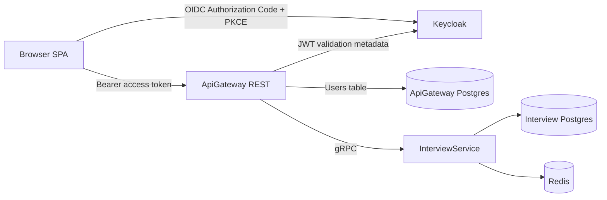

# FitFlow ApiGateway

FitFlow ApiGateway is the REST boundary for the FitFlow interview flow. It validates Keycloak-issued OIDC access tokens, owns the local user table, enforces one hidden interview per user, and proxies interview operations to `InterviewService` over gRPC.

## What This Service Does

- Exposes a small REST API for browser clients.
- Validates Keycloak JWT access tokens.
- Creates or updates a local user row from the token `sub`, `email`, `given_name`, and `family_name` claims.
- Stores the user's current InterviewService interview id server-side.
- Prevents clients from seeing or submitting interview ids.
- Maps InterviewService gRPC contracts to stable JSON DTOs.
- Hosts local Docker wiring for Keycloak, Postgres, Redis, ApiGateway, and InterviewService.

## Repository Layout

```text
.
|-- ApiGateway/                     # ASP.NET Core minimal API
|-- ApiGateway.IntegrationTests/    # xUnit integration smoke tests
|-- Documentation/                  # Agent-facing API guide
|-- keycloak/                       # Local realm import and custom login theme
|-- compose.yaml                    # Compatibility include for ../../compose.yaml
|-- DOCUMENTATION.md                # Generated API/code documentation
|-- README.md                       # Project overview and operator guide
```

## Runtime Architecture



## Local URLs

| Service | URL |
| --- | --- |
| ApiGateway | `http://localhost:5266` |
| Keycloak | `http://localhost:8080` |
| Keycloak realm | `http://localhost:8080/realms/fitflow` |
| InterviewService gRPC | `http://localhost:7297` |
| Redis UI | `http://localhost:58001` |

The main Docker stack now lives one folder above `Backend`, in `../../compose.yaml`, and starts both the frontend and backend.

## Prerequisites

- Docker Desktop
- .NET SDK `10.0`
- Access to NuGet.org
- Sibling `../InterviewService` checkout for the Docker build context

## Configuration

ApiGateway reads service configuration from `ApiGateway/appsettings.json`. Docker-specific service addresses live there; localhost development overrides live in `ApiGateway/appsettings.Development.json`.

Important keys:

| Key | Purpose |
| --- | --- |
| `ConnectionStrings:ApiGateway` | ApiGateway Postgres connection string |
| `InterviewService:GrpcAddress` | InterviewService gRPC endpoint |
| `Authentication:Authority` | Public Keycloak issuer |
| `Authentication:MetadataAddress` | OIDC discovery document URL |
| `Authentication:BackchannelAuthority` | Internal Keycloak authority used in Docker |
| `Authentication:Audience` | Required token audience, currently `fitflow-api` |
| `Cors:AllowedOrigins` | Browser origins allowed to call ApiGateway |

Do not commit production secrets to this repository.

## Running Locally

From the `Main` folder, start the local stack:

```powershell
docker compose up -d --build
```

Check status:

```powershell
docker compose ps
Invoke-WebRequest http://localhost:5266/ -UseBasicParsing
```

Stop and remove project containers while preserving volumes:

```powershell
docker compose down --remove-orphans
```

Reset all local volumes:

```powershell
docker compose down -v --remove-orphans
```

## REST API

| Method | Path | Auth | Description |
| --- | --- | --- | --- |
| `GET` | `/` | No | Service status |
| `GET` | `/me` | Yes | Current local user |
| `GET` | `/my-interview` | Yes | Create or load the current user's interview |
| `POST` | `/my-interview/answers` | Yes | Submit an answer to the current user's interview |

Use:

```http
Authorization: Bearer <keycloak-access-token>
```

Interview ids are intentionally hidden. Clients should never call old resource-id routes such as `/interviews/{id}`.

Detailed API usage is documented in [Documentation/ApiUsageForAgents.md](Documentation/ApiUsageForAgents.md).

Generated code and DTO summaries are documented in [DOCUMENTATION.md](DOCUMENTATION.md).

## Development Commands

Restore and build:

```powershell
dotnet restore .\ApiGateway.sln
dotnet build .\ApiGateway.sln
```

Run tests:

```powershell
dotnet test .\ApiGateway.sln
```

Regenerate XML documentation output:

```powershell
dotnet build .\ApiGateway.sln
```

`DOCUMENTATION.md` is generated from the XML documentation file emitted by `ApiGateway.csproj`.

## Keycloak

The local realm is imported from `keycloak/realm/fitflow-realm.json`.

Current local auth behavior:

- Realm: `fitflow`
- SPA client: `fitflow-spa`
- API audience: `fitflow-api`
- Flow: Authorization Code + PKCE `S256`
- TOTP required after registration / first login
- Registration uses email as username
- First and last name are optional
- Access tokens last 5 minutes
- SSO idle session lasts 14 days
- SSO max session lasts 90 days

The custom login theme lives under `keycloak/themes/fitflow-vuetify/login`.

## Pre-Production Notes

- Keep `Authentication:RequireHttpsMetadata=false` only for local development.
- Replace local compose credentials through environment variables or a deployment secret store.
- Keep access tokens short-lived.
- Do not expose InterviewService directly to browsers.
- Keep InterviewService aware of interviews only; user ownership belongs to ApiGateway.
- Avoid committing generated `bin/`, `obj/`, local `.env`, or test result files.
